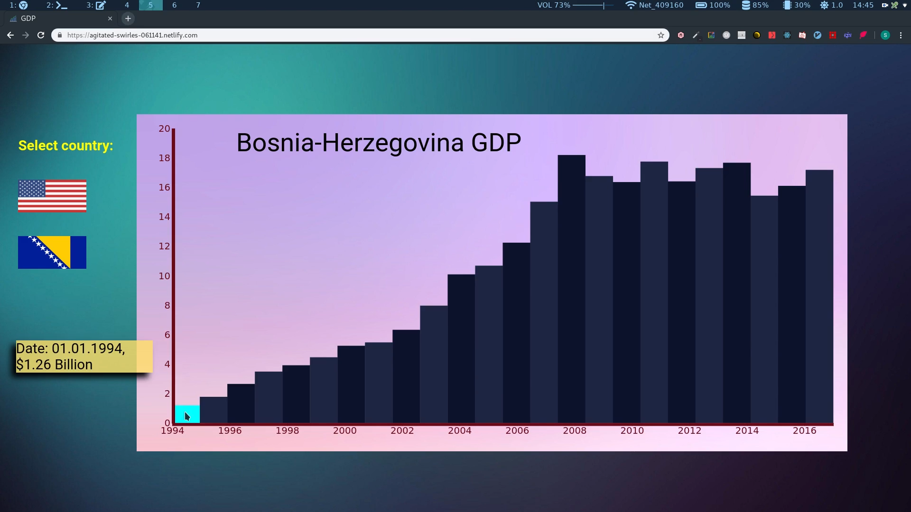

## Gross domestic product (GDP) visualization app

GDP visualization app for Bosnia & Herzegovina and United States of America made with ReactJS and D3.

**Live page:** <a  href="https://agitated-swirles-061141.netlify.com/">here</a>

#### <u>Video:</u>

<!-- <iframe  src="https://player.vimeo.com/video/352262213"  width="800"  height="455"  frameborder="0"  allow="autoplay; fullscreen"  allowfullscreen></iframe> -->

#### <u>Technologies used:</u>

- HTML5

- CSS3(Sass)

- Javascript(ReactJS)

- D3.js
